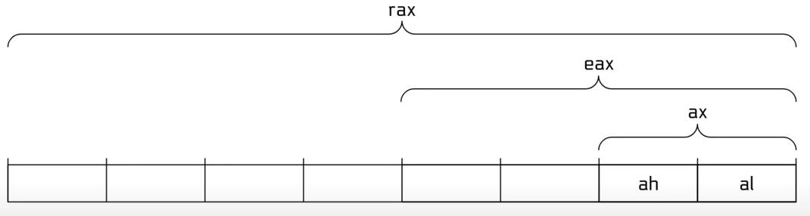
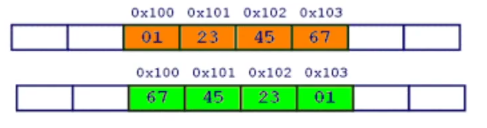

# Introduction: What is Computer Systems Security

- [Diapositivas](https://docs.google.com/presentation/d/1YlTxeZg03P234EgG4E4JNGcit6LZovAxfYGL1YSLwfc/edit?usp=sharing)
- [Extended Q&A 8/19/2021](https://www.youtube.com/watch?v=2chgNhxt-Kc)

# Fundamentals

## Computer Architecture

- John Mauchly (Físico).
- John Presper Eckbert (Ingeniero eléctrico).
- John Von Neumann (Matemático).

John Von Neumann, EDVAC, 1945.


## Introduction to Binary Files

Partiendo de un binario de sistema como lo es `/bin/cat`, buscando responder a la pregunta:

```bash
❯ file /bin/cat
/bin/cat: ELF 64-bit LSB pie executable, x86-64, version 1 (SYSV), dynamically linked, interpreter /lib64/ld-linux-x86-64.so.2, BuildID[sha1]=7b3c4131450fabd010fe74ac5589074c9431cf4a, for GNU/Linux 3.2.0, stripped
```

### What is an ELF?

- Executable and Linkable Format.
- ELF es un formato de archivo binario.
- Contiene el programa y su data.
- Describe como un programa debería ser cargado (program/segment headers).
- Contiene metadata que describen los componentes del programa (section headers).

### ELF Program Headers

- Especifícan la información requerida para preparar el programa para su ejecución. Los tipos de entrada más importantes son:
  - **INTERP:** define la librería que debería ser usada para cargar este ELF en la memoria.
  - **LOAD:** define una parte del archivo que debería ser cargada en la memoria.
- Son la fuente de información usada cuando se carga un archivo.

*Extracción de `readelf -a /bin/cat`:*

```bash
Program Headers:
  Type           Offset             VirtAddr           PhysAddr
                 FileSiz            MemSiz              Flags  Align
  PHDR           0x0000000000000040 0x0000000000000040 0x0000000000000040
                 0x0000000000000268 0x0000000000000268  R      0x8
  INTERP         0x00000000000002a8 0x00000000000002a8 0x00000000000002a8
                 0x000000000000001c 0x000000000000001c  R      0x1
      [Requesting program interpreter: /lib64/ld-linux-x86-64.so.2]
  LOAD           0x0000000000000000 0x0000000000000000 0x0000000000000000
                 0x0000000000001540 0x0000000000001540  R      0x1000
  LOAD           0x0000000000002000 0x0000000000002000 0x0000000000002000
                 0x0000000000004819 0x0000000000004819  R E    0x1000
  LOAD           0x0000000000007000 0x0000000000007000 0x0000000000007000
                 0x0000000000001f28 0x0000000000001f28  R      0x1000
  LOAD           0x0000000000009c50 0x000000000000ac50 0x000000000000ac50
                 0x0000000000000630 0x00000000000007c8  RW     0x1000
  DYNAMIC        0x0000000000009df8 0x000000000000adf8 0x000000000000adf8
                 0x00000000000001e0 0x00000000000001e0  RW     0x8
  NOTE           0x00000000000002c4 0x00000000000002c4 0x00000000000002c4
                 0x0000000000000044 0x0000000000000044  R      0x4
  GNU_EH_FRAME   0x0000000000007eb0 0x0000000000007eb0 0x0000000000007eb0
                 0x00000000000002e4 0x00000000000002e4  R      0x4
  GNU_STACK      0x0000000000000000 0x0000000000000000 0x0000000000000000
                 0x0000000000000000 0x0000000000000000  RW     0x10
  GNU_RELRO      0x0000000000009c50 0x000000000000ac50 0x000000000000ac50
                 0x00000000000003b0 0x00000000000003b0  R      0x1
```

### ELF Section Headers

- Son una vista diferente de un ELF con información útil para introspección, debuggeo, etc.
- Secciones importantes:
  - **.text:** el código ejecutable del programa.
  - **.plt** y **.got:** usado para resolver y despachar llamadas de librerías.
  - **.data:** usado por data global pre-inicializada que se puede modificar (así como arreglos globales con valores iniciales).
  - **.rodata:** usada por data de sólo lectura (tal como cadenas de caracteres constantes).
  - **.bss:** usada por data global no inicializada que se puede modificar (así como arreglos globales sin valores iniciales).
- Los Section headers *no* son necesariamente una parte del ELF, sólo segmentos definidos por los program headers son necesarios para su carga y su operación.
- Los Section headers son sólo metadata.

### Symbols

- Binarios (y librerías) que usen librerías cargadas dinámicamente dependen de los `symbols` (los nombres) para encontrar las librerías, y resolver las llamadas a funciones a esas librerías, etc.


### Interacting with your ELF

- **gcc** para crear el ELF.
- **readelf** para analizar el header del ELF.
- **objdump** para analizar el header del ELF y desensamblar el código fuente.
- **nm** para visualizar los symbols del ELF.
- **patchelf** para cambiar algunas propiedades del ELF.
- **objcopy** para intercambiar secciones del ELF.
- **strip** para remover información relevante (tal como los symbols).
- **katai** struct (http://ide.kaitai.io/) para visualizar a través del ELF interactivamente.

## Linux Process Loading

### Portrait of a process

Cada proceso de Linux tiene:

- estado (running, waiting, stopped, zombie).
- prioridad (y otro tipo de información relacionada a la programación/planificación).
- padre, hermanos, hijos.
- recursos compartidos (archivos, pipes, sockets).
- espacio en memoria virtual.
- contexto de seguridad.
  - uid y gid efectivos.
  - uid y gid guardados.
  - capabilities.

### But where do processes come from?

En Linux, los procesos ¡se progagan por mitosis!

Mediante **fork** y (más reciente) **clone** son llamadas a sistema que crean una casi idéntica copia  del proceso del que lo está llamando: un padre y un hijo.

Después, el proceso hijo usualmente usa la syscall **execve** para remplazarse a sí mismo con otro proceso.

Ejemplo:

- Cuando se usa `/bin/cat` en bash.
- bask hace un **fork** de sí mismo a un viejo proceso padre y al proceso hijo.
- El proceso hijo usa **execve** `/bin/cat` transformándose en `/bin/cat`.

### Can we load?

Antes que cualquier cosa sea cargada, el kernel verifica los permisos de ejecución.

Si un archivo no es ejecutable, **execve** fallará.

### What to load?

Para identificar que cargar, el kernel de Linux lee la primera parte del archivo (`/bin/cat` por ejemplo) y toma una decisión:

1. Si el archivo empieza con **#!** (lo que es conocido como el shebang), el kernel extrae el intérprete del resto de la línea y ejecuta el intérprete con el archivo original como argumento.
2. Si el archivo corresponde al formato de `/proc/sys/fs/binfmt_misc`, el kernel ejecuta el intérprete especificado por ese formato con el archivo original como argumento.
3. Si el archivo es un ELF enlazado dinámicamente, el kernel lee el intérprete/loader definido en el ELF, carga el intérprete y el archivo original, y deja que el intérprete tome el control.
4. Si el archivo es un ELF enlazado estáticamente, el kernel lo cargará.
5. Otros formatos de archivos legacy son verificados.

¡Esto puede ser recursivo!

### Dynamically linked ELFS: the interpreter

La carga del proceso es realizada por el intérprete del ELF específicado en el binario.

```bash
❯ readelf -a /bin/cat | grep interpreter
      [Requesting program interpreter: /lib64/ld-linux-x86-64.so.2]
```

Coloquialmente conocido como "the loader".

Puede ser sobreescrito: `/lib64/ld-linux-x86-64.so.2 /bin/cat /flag`

O cambiado permanentemente `patchelf --set-interpreter`

### Dynamically linked ELFS: the loading process

1. El programa y su intérprete son cargados por el kernel.
2. El intérprete ubica las librerías.
   1. La variable de entorno `LD_PRELOAD`, y cualquier cosa que se encuentre en `/etc/ld.so.preload`.
   2. La variable de entorno `LD_LIBRARY_PATH` (puede ser configurada en la shell).
   3. `DT_RUNPATH` o `DT_RPATH` especificados en el binario (ambos pueden ser modificados por patchelf).
   4. Configuración del sistema (`/etc/ld.so.conf`).
   5. `/lib` y `/usr/lib`.
3. El intérprete carga las librerías.
   1. Estas librerías pueden depender de otras, causando que también sean cargadas.
   2. Actualización de reubicaciones.

### Where is all this getting loaded to?

Cada proceso en Linux tiene un espacio de memoria virtual. El cuál contiene:

- El binario.
- Las librerías.
- El "heap" (para la memoria asignada dinámicamente).
- El "stack" (para variables locales de funciones).
- Cualquier memoria escíficamente mapeada por el programa.
- Algunas regiones de apoyo.
- Código de kernel en la "mitad superior" de la memoria (arriba de 0x80000000000000 en arquitecturas de 64 bits), inaccesibles por el proceso.

La memoria virtual es dedicada al proceso.

La memoria física es compartida por todo el sistema.

Se puede visualizar todo el espacio mirando en `/proc/self/maps`.

### The Standard C library

libc.so es enlazada a casi cada proceso.

Provee de funcionalidada para:

- printf().
- scanf().
- socket().
- atoi().
- malloc().
- free().

...y a otro tipo de cosas

- xdr_keystatus()

### The loading process (for statically linked binaries)

1. El binario es cargado.

### Cat is initialized

Cada binario ELF puede especificar constructores, los cuales son funciones que son ejecutados antes de que el programa sea lanzado.

Por ejemplo, dependiendo en la versión, libc puede inicializar regiones en la memoria para asignaciones dinámicas (malloc/free) cuando el programa sea ejecutado.

¡Es posible especificar los propios!

```c
__attribute__((constructor)) void haha() {
    write(1, "Hello world!\n", 6);
}
```

Permitiendo ser válido también para `LD_PRELOAD`.

## Linux Process Runtime

### Cat is launched

Un ELF normal automáticamente llama `__libc_start_main()` en libc, lo cuál llama a la función `main()` del programa.

¡El código se está ejecutando!

¿Ahora qué?

### Cat reads its arguments and environment

`int main(int argc, void **argv, void **envp);`

Todo el input del programa proveniente del mundo exterior, al momento de la ejecución, comprende de:

- Los objetos cargados (binarios y librerías).
- Argumentos de la línea de comandos en argv.
- Variables de entorno o "environment" en envp.

Por supuesto, el programa necesita seguir interactuando con el mundo exterior.

### Using library functions

La operación del binaro *import symbols* necesita ser resuelta usando la operación *export symbols* de las librerías.

En el pasado, esto era un proceso on-demand y llevaba consigo un gran peligro.

Hoy en día, esto es hecho hecho cuando el binario es cargado y es mucho más seguro.

Se explorará este punto más adelante.

### Interacting with the environment

Casi todos los programas tienen que interactuar con el mundo exterior.

Esto es realizado principalmente via llamadas a sistema (`man syscalls`). Cada llamada a sistema se encuentra bien documentada en la sección 2 de las páginas del manual. (ejemplo `man 2 open`).

Se le puede dar seguimiento a los procesos de las llamadas a sistema usando `strace`.

### System Calls

Las llamadas a sistema tienen interfaces bien definidas que rara vez cambian.

Existen más de 300 llamadas a sistema en Linux. Por ejemplo:

- `int open(const char *pathname, int flags)` - retorna un archivo y un nuevo descriptor de archivo del archivo que se abrió (esto también aparece en `/proc/self/fd`).
- `ssize_t read(int fd, void *buf, size_t count)` - lee la data del descriptor de archivo.
- `ssize_t write(int fd, void *buf, size_t count)` - escribe la data en el descriptor de archivo.
- `pid_t fork()` - bifurca o crea un proceso identico como hijo. Retorna 0 si eres el hijo y el PID del hijo si eres el padre.
- `int execve(const char *filename, char **argv, char **envp)` - remplaza tus procesos.
- `pid_t wait(int *wstatus)` - espera el termino del hijo, retorna su PID, escribe su estatus en *wstatus.
- `long syscall(long syscall, ...)` - invoca el syscall especificado.

Combinaciones de señales típicas:

- fork, execve, wait (como una shell).
- open, read, write (cat).

### Signals

Las llamadas a sistema son una forma en la el proceso interactúa con el sistema operativo. Pero ¿qué pasa al revés?

Llamadas a sistema relevantes:

- `sighandler_t signal(int signum, sighandler_t handler)` - registra un manejador de señales.
- `int sigaction(int signum, const struct sigaction *act, struct sigaction *oldact)` - una forma más moderna de registrar un manejador de señales.
- `int kill(pid_t pid, int sig)` - manda una señal a un proceso.

Las señales pausan la ejecución del proceso e invocan el manejador.

Los mandejadores son funciones que toman un argumento: el número de señal.

Sin un manejador para una señal, la acción por defecto es usada (casi siempre, kill).

SIGKILL (signal 9) y SIGSTOP (signal 19) no pueden ser gestionadas.

Lista completa en la sección 7 del manual (`man 7 signal`) y `kill -l`. Señales comúnes:

| Señal | Tipo | Descripción |
|---|---|---|
| `SIGHUP` | Term | Hangup detectado de terminal controlada o muerte de proceso controlado |
| `SIGINT` | Term | Interrupción por teclado |
| `SIGQUIT` | Core | Abandono por teclado |
| `SIGILL` | Core | Instrucción Ilegal |
| `SIGABRT` | Core | Señal de aborto de abort(3) |
| `SIGFPE` | Core | Excepción de punto flotante |
| `SIGKILL` | Term | Señal de kill |
| `SIGSEGV` | Core | Referencia de memoria inválida |
| `SIGPIPE` | Term | Pipe rota: escritura a pipe sin lectores; ver pipe(7) |
| `SIGALRM` | Term | Señal de timer de alarm(2) |
| `SIGTERM` | Term | Señal de termino |
| `SIGUSR1` | Term | Señal 1 definida por usuario |
| `SIGUSR2` | Term | Señal 2 definida por usuario |
| `SIGCHLD` | Ign | Hijo pausado o terminado |
| `SIGCONT` | Cont | Reanudar si estaba pausado |
| `SIGSTOP` | Stop | Parar proceso |
| `SIGTSTP` | Stop | Parar escrito en terminal |
| `SIGTTIN` | Stop | Input de terminal para proceso en segundo plano |
| `SIGTTOU` | Stop | Output de terminal para proceso en segundo plano |

### Shared memory

Otra manera de interactuar con el mundo exterior es mediante la compartición de memoria con otros procesos.

Requiere que se establezcan llamadas a sistema, pero una vez establecidas la comunicación ocurre sin ellas.

La forma más fácil es usar el archivo de shared memory-mapped ubicado en `/dev/shm`.

### Process termination

Los procesos terminan de alguna de estas dos formas:

1. Recibiendo una señal no gestionada.
2. Llamando llamada a sistema `exit()`: `int exit(int status)`.

Todos los procesos tienen que ser "cosechados":

- Después de su termino, permanecerán en un estado zombie hasta use el `wait()` de sus padres.
- Cuando esto pasa, su código de salida será retornado al padre y el proceso será liberado.
- Si el padre muere win usar `wait()` en ellos, son reparentados al PID 1 y permanecerán ahí hasta que sean limpiados.

## Assembly Code

### Assembly

Es el único verdadero lenguaje de programación, en que se refiere a un CPU.

Conceptos:

- Intrucciones.
  - Manipulación de data.
  - Comparación.
  - Control de flujo.
  - System calls
- Registros.
- Memoria.
  - Programa.
  - Pila.
  - Otra memoria mapeada.

### Registers

Los registros son bastante rápidos, temporalmente guardan data.

Algunos utilizados para "propósitos generales":

- 8085: a, c, d, b, e, h, l.
- 8086: ax, cx, dx, bx, **sp**, **bp**, si, di.
- x86: eax, ecx, edx, ebx, **esp**, **ebp**, esi, edi.
- amd64: rax, rcx, rdx, rbx, **rsp**, **rbp**, rsi, rdi, r8, r9, r10, r11, r12, r13, r14, r15.
- arm: r0, r1, r2, r3, r4, r5, r6, r7, r8, r9, r10, r11, r12, r13, **r14**, **r15**.

La dirección para la siguiente instrucción se encuentra en los registros:

eip (x86), rip (amd64), r15 (arm)

Varias extensiones añaden otros registros (x87, MMX, SSE, etc).

### Partial Register Access



Los registros pueden ser accedidos parcialmente.

Debido a una rareza histórica, acceder a **eax** convertirá en cero el resto del **rax**. Esto fue diseñado como medida de seguridad para conservar partes sin tocar del registro.

### All partial accesses on amd64 (that I know of)

| 64 | 32 | 16 | 8H | 8L |
|---|---|---|---|---|
| rcx | ecx | cx | ah | al |
| rdx | edx | dx | ch | cl |
| rax | eax | ax | dh | dl |
| rbx | ebx | bx | bh | bl |
| rsp | esp | sp |  | spl |
| rbp | ebp | bp |  | bpl |
| rsi | esi | si |  | sil |
| rdi | edi | di |  | dil |
| r8 | r8d | r8w |  | r8b |
| r9 | r9d | r9w |  | r9b |
| r10 | r10d | r10w |  | r10b |
| r11 | r11d | r11w |  | r11b |
| r12 | r12d | r12w |  | r12b |
| r13 | r13d | r13w |  | r13b |
| r14 | r14d | r14w |  | r14b |
| r15 | r15d | r15w |  | r15b |

### Instructions

Forma general:

`OPCODE OPERAND OPERAND, ...`

`OPCODE` - Que hacer
`OPERANDS` - Que hacer en/con

```asm
mov rax, rbx
add rax, 1
cmp rax, rbx
jmp some_location
```

### Instructions (data manipulation)

Las intrucciones pueden mover y manipular data en registros y memoria.

```asm
mov rax, rbx # mover el valor de rbx a rax
mov rax, [rbx+4] # de la dirección de rbx + 4 posiciones extraer el valor y moverlo a rax
add rax, rbx # sumar el rbx a rax y guardar en rax
mul rsi # multiplicar el valor en rax por rsi y guardar en rax
inc rax # incrementa rax en 1
inc [rax] # incrementa el puntero de rax en 1
```

### Instructions (control flow)

El flujo de control es determinado por saltos condicionales e incondicionales.

Incondicionales: call, jmp, ret

Condicionales:

| Operación | Descripción |
|---|---|
| je <br/> jne | jump si es igual <br/> jump si no es igual |
| jg <br/> jl | jump si es mayor <br/> jump si es menor |
| jle <br/> jge | jump si es menor o igual <br/> jump si es mayor o igual |
| ja <br/> jb | jump si se cumple instrucción anterior (arriba) <br/> jump si se cumple siguiente instrucción (abajo) |
| jae <br/> jbe | jump si se cumple instrucción anterior (arriba) o igual <br/> jump si se cumple siguiente instrucción (abajo) o igual |
| js <br/> jns | jump si tiene signo <br/> jump si no tiene signo |
| jo <br/> jno | jump si desborda <br/> jump si no desborda |
| jz <br/> jnz | jump si es cero <br/> jump si no es cero |

### Instructions (conditionals)

Las conficionales utilizan el registro de "flags" como apoyo:

- eflags (x86), rflags (amd64), aspr (arm).

Actualizado para (x86/amd64):

- Operaciones aritméticas.
- cmp - sustracción (`cmp rax, rbx`).
- test - operador and (`test rax, rax`).

| Operación | Descripción | Banderas |
|---|---|---|
| je <br/> jne | jump si es igual <br/> jump si no es igual | ZF=1 <br/> ZF=0 |
| jg <br/> jl | jump si es mayor <br/> jump si es menor | ZF=0 y SF=OF <br/> SF!=OF |
| jle <br/> jge | jump si es menor o igual <br/> jump si es mayor o igual | ZF=1 y SF!=OF <br/> SF=OF |
| ja <br/> jb | jump si se cumple instrucción anterior (arriba) <br/> jump si se cumple siguiente instrucción (abajo) | CF=0 y ZF=0 <br/> CF=1 |
| jae <br/> jbe | jump si se cumple instrucción anterior (arriba) o igual <br/> jump si se cumple siguiente instrucción (abajo) o igual | CF=0 <br/> CF=1 o ZF=1 |
| js <br/> jns | jump si tiene signo <br/> jump si no tiene signo | SF=1 <br/> SF=0 |
| jo <br/> jno | jump si desborda <br/> jump si no desborda | OF=1 <br/> OF=0 |
| jz <br/> jnz | jump si es cero <br/> jump si no es cero | ZF=1 <br/> ZF=0 |

### Instructions (system calls)

Las system calls (en amd64) son disparadas por:

1. Guardar número de la system call en rax.
2. Guardar los argumentos en rdi, rsi, etc.
3. Llamar a la instrucción `syscall`.

### Memory (stack)

El stack cubre 4 usos principales:

1. Dar seguimiento al "callstack" de un programa.
   1. Los valores retornados son "empujados" a la stack durante su llamada y "desapilados" durante un retorno (push y pop).
2. Contienen variables locales de funciones.
3. Proveer espacio de ejecución para evitar el uso elevado de registros.
4. Pasar argumentos de funciones.

Registros relevantes (amd64): rsp, rbp.

Instrucciones relevantes (amd64): push, pop.

### Memory (other mapped regions)

Otras regiones podrían ser mapeadas en memoria. Anteriormente fueron mencionadas que ciertas regiones son cargadas en relación a las directivas de las cabeceras de los ELF pero las funcionalidades como `mmap` y `malloc` pueden causar que otras regiones puedan ser mapeadas también.

Esta funcionalidad será tomada en cuenta en módulos posteriores.

### Memory (endianess)

Data en la mayoría de los sistemas actuales es alojada hacia atrás, en *little endian*.



¿Por qué?

- Rendimiento (histórico).
- Facilitar la aseignación de direcciones para diferentes tamaños.
- Compatibilidad 8086 (apócrifa).

### Signedness: Two's Compliment 29:33

### Instructions

### Instructions

# Further Reading

- An awesome intro series that covers some of the fundamentals from [LiveOverflow](https://www.youtube.com/watch?v=iyAyN3GFM7A&list=PLhixgUqwRTjxglIswKp9mpkfPNfHkzyeN&index=1).
- Phineas Fisher’s [writeup](https://pwn.college/modules/intro/phisher-hackback.txt) of the hacking team disclosure (discussed in the What is Computer Systems Security video). Originally posted on pastebin by Phineas Fisher, but since removed.
- [Some more (mirrored) writeups](https://github.com/Alekseyyy/phineas-philes) from Phineas Fisher, for the curious.
- Executable and Linkable Format 101 Part 1-4 - https://www.intezer.com/blog/research/executable-linkable-format-101-part1-sections-segments/
- System calls in the Linux kernel. Part 4. -  https://0xax.gitbooks.io/linux-insides/content/SysCall/linux-syscall-4.html
- Understanding the Memory Layout of Linux Executables - https://gist.github.com/CMCDragonkai/10ab53654b2aa6ce55c11cfc5b2432a4


# Referencias

- X86 Opcode and Instruction Reference - http://ref.x86asm.net/
- Linux System Call Table for x86_64 - https://blog.rchapman.org/posts/Linux_System_Call_Table_for_x86_64/