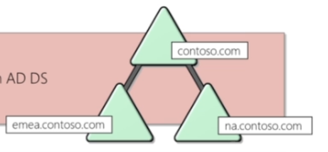
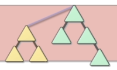
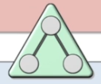
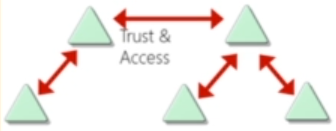

# Active Directory

## Tabla de Contenido <!-- omit from toc -->

- [¿Qué es?](#qué-es)
- [¿Por qué?](#por-qué)
- [Componentes Físicos](#componentes-físicos)
  - [Domain Controller](#domain-controller)
  - [AD DS Data Store (Active Directory Domain Services)](#ad-ds-data-store-active-directory-domain-services)
- [Componentes Lógicos](#componentes-lógicos)
  - [AD DS Schema](#ad-ds-schema)
  - [Domains](#domains)
  - [Trees](#trees)
  - [Forests](#forests)
  - [Organizational Units (OUs)](#organizational-units-ous)
  - [Trusts](#trusts)
  - [Objects](#objects)
- [Referencias](#referencias)

## ¿Qué es?

- Es un servicio de directorio desarrollado por Microsoft para gestionar dominios de red.
- Guarda información relacionada con objetos, como computadoras, usuarios, impresoras, etc.
    - Se puede visualizar como un directorio telefónico.
- Se autentica usando tickets de Kerberos.
    - En dispostivos que no tengan Windoes, como máquinas con Linux, firewalls, etc. se pueden autenticar al Active Directory vía RADIUS o LDAP.

## ¿Por qué?

- Es el servicio de gestión de identidades más usado en el mundo.
    - Se encuentra implementado en la red de numerosas compañias como servicio.
- Puede ser explotado sin siquiera atacar exploits que pueden ser parcheables.
    - En vez de eso se abusan características, confianza, componentes, entre otras cosas.

## Componentes Físicos

### Domain Controller

- Cuenta con una copia de la colección del directorio.
- Provee servicios de autenticación y autorización.
- Replica actualizaciones a otros domain controllers en el dominio y bosque.
- Brinda acceso administrativo para gestionar cuentas de usuario y recursos de red.

### AD DS Data Store (Active Directory Domain Services)

- Contiene la base de datos de archivos y procesos y gestiona la información del directorio de usuarios, servicios y aplicaciones.
- Consiste en el archivo `Ntds.dit`.
- Almacenado predeterminadamente en el directorio `%SystemRoot%\NTDS` en todos los domain controllers.
- Siendo sólo accesible a través de procesos y protocoles del domain controller.

## Componentes Lógicos

### AD DS Schema

- Define cada tipo de objeto que puede ser guardado en el directorio.
- Hace cumplir reglas respecto a la creación de objetos y configuración.

| Tipos de objetos | Función | Ejemplos |
|---|---|---|
| Class Object | Que objetos pueden ser creados en el directorio | - Usuario &rarr; Computadora |
| Attribute Object | Información que puede ser enlazada a un objeto | - Nombre a desplegar |

### Domains

- Son usados para agrupar y gestionar objetos en una organización.
- Perímetro administrativo para aplicar políticas a grupos de objetos.
- Perímetro de replicación para replicar data entre domain controllers.
- Perímetro de autenticación y autorización que provee una forma de limitar el alcance del acceso a recursos.

### Trees

- Un domain tree es una jerarquía de dominios dentro de el AD DS.
- Comparte el namespace con el dominio padre.
- Puede tener dominios hijos adicionales.
- Predeterminadamente crea confianza transitiva de dos vías con otros dominios.

### Forests

- Es una colección de uno o más domain trees.
- Comparte un schema común.
- Comparte una partición de configuración común.
- Comparte un catálogo global común para habilitar búsquedas.
- Habilita confianza entre todos los dominios en el forest.
- Comparte los Enterprise Admins y los grupos de Schema Admins.

### Organizational Units (OUs)

- Son contenedores del Active Directory que pueden contener usuarios, grupos, computadoras y otros OUs.
- Representa la organización logica y jerárquicamente.
- Gestiona de consistentemente colecciones de objetos.
- Delega permisos para administrar grupos de objetos.
- Aplica políticas.

### Trusts

- Provee un mecanismo para que los usuarios obtengan acceso a recursos en otro dominio.

| Tipos de Trusts | Descripción | Diagrama |
|---|---|---|
| Direccional | La dirección de confianza fluye de dominio de confianza a dominio de confianza.  |  |
| Transitivo | La relación de confianza es extendida más allá de la relación de confianza de dos dominios, incluyendo otros dominios en los que se confía |  |

- Todos los dominios de un bosque confían en otros dominios del bosque.
- La confianza puede ser extendida afuera del bosque.

### Objects

| Objeto | Descripción |
|---|---|
| User | - Habilita acceso a recursos de red a un usuario |
| InetOrgPerson | - Similar a la cuenta de usuario   - Usado para brindar compatibilidad a otros servicios de directorios |
| Contacts | - Usado principalmente para asignar direcciones de e-mail a usuarios externos   - No habilita acceso a la red |
| Groups | - Usado para simplificar la administración de control de acceso  |
| Computers | - Habilita autenticación y auditoría de acceso informático a los recursos |
| Printers | - Usado para simplificar el proceso de ubicación y conexión a impresoras |
| Shared folders | - Permite a los usuarios la búsqueda de carpetas compartidas basándose en sus propiedades |

## Referencias

- Microsoft Virtual Academy.
