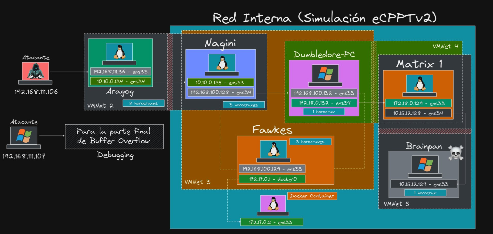

# eCPPTv2 Lab

https://www.youtube.com/watch?v=Q7UeWILja-g



## Descargas de máquinas de Vulnhub

- [Descargar máquina Aragog](https://www.vulnhub.com/entry/harrypotter-aragog-102,688/)
- [Descargar máquina Nagini](https://www.vulnhub.com/entry/harrypotter-nagini,689/)
- [Descargar máquina Fawkes](https://www.vulnhub.com/entry/harrypotter-fawkes,686/)
- [Descargar máquina Matrix 1](https://www.vulnhub.com/entry/matrix-1,259/)
- [Descargar máquina Brainpan](https://www.vulnhub.com/entry/brainpan-1,51/)

## Setup

Es probable que las máquinas no den IP dado que por defecto están configuradas a ser importadas en virtualbox por lo que hay que realizar los siguientes pasos para su configuración:

1. Encender máquina y en la pantalla del GRUB presionar la tecla `e`.
2. Buscar la línea (ejemplo):

```text
linux /boot/vmlinuz-1234-amd64 root=UID-fffff-ad-1234 ro quiet
```

Cambiar por:

```text
linux /boot/vmlinuz-1234-amd64 root=UID-fffff-ad-1234 rw init=/bin/bash
```

3. Presionar `F10` y esperar reinicio de máquina.
4. Verificar con `ip a` nombre de la interfaz.
5. Agregar en `/etc/network/interfaces` lo siguiente por cada interfaz:

```text
auto <interfaz>
allow-hotplug <interfaz>
iface <interfaz> inet dhcp
```

6. Eliminar de `/etc/network/interfaces` interfaces que no se encuentren listadas en `ip a`.
7. Guardar y reiniciar.

